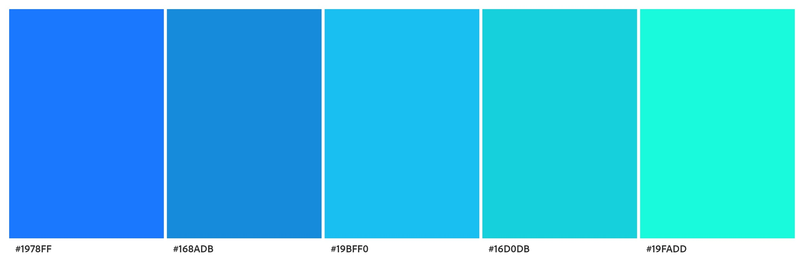
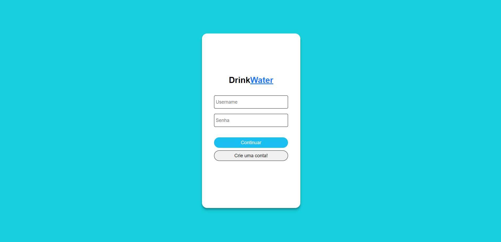
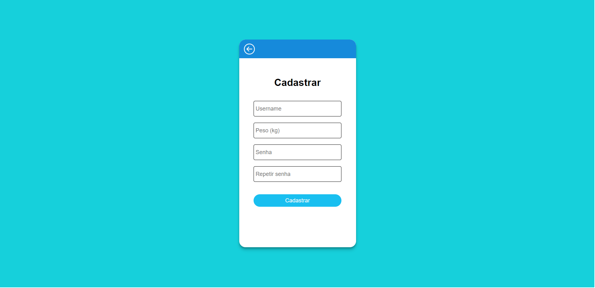
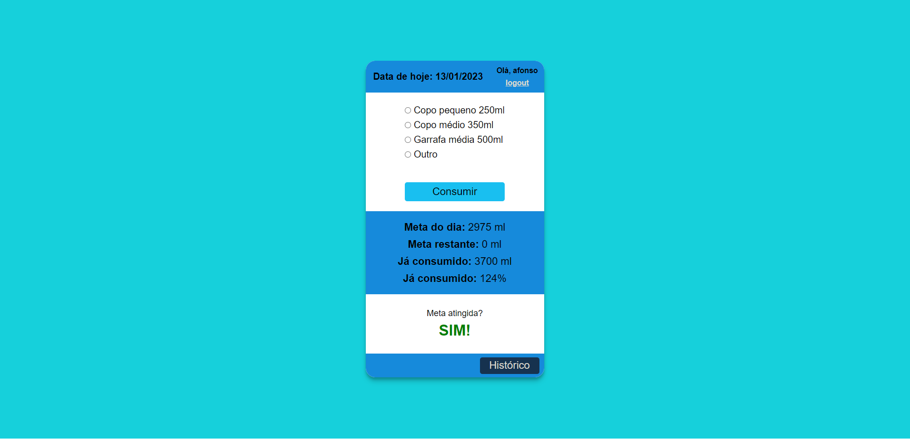
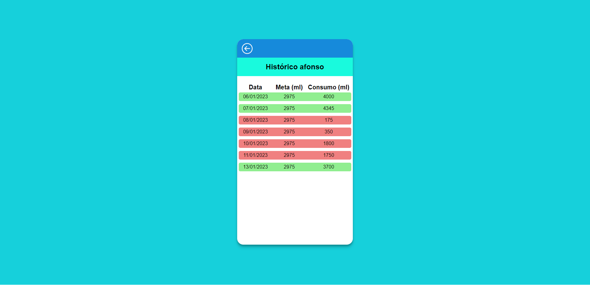
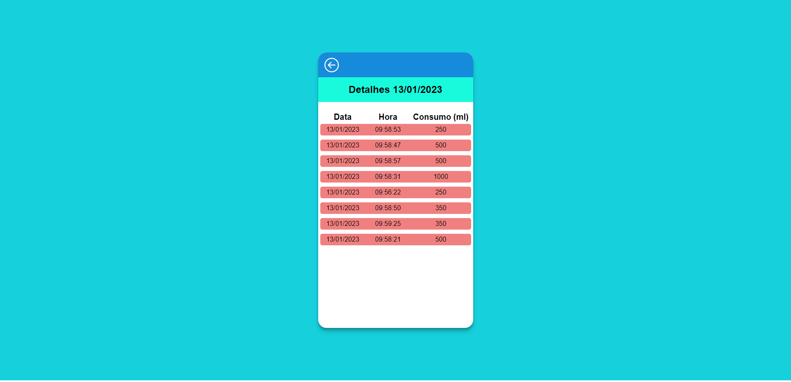

# `Projeto`
Projeto Drink-Water

# `Descrição`
O Projeto Drink-Water é uma plataforma para controle do consumo de água. Trata-se de uma ferramenta onde usuários cadastrados e logados podem navegar. A funcionalidade principal é cadastrar a quantidade de mililitros de água consumida e o sistema armazena estes registros em uma banco de dados e retorna essencialmente duas informações principais:  
1) a quantidade diária de água que o usuário já consumiu e o quanto falta consumir*.  
2) o histórico do usuário, mostrando em quais dias ele atingiu a sua meta e em quais dias não atingiu.  

*O cálculo da quantidade necessária é feito atráves da expressão L = P * Vu, onde:  
L = quantidade, em mililitros, que o usuário deve beber em um dia;  
P = peso, em kg, do usuário. Informado no momento do cadastro;  
Vu = volume por kilograma que o usuário deve injerir. Este valor é assumido igual a 35ml/kg.
 

Neste projeto foram desenvolvidos tanto o *frontend* quanto o *backend*. A documentação da API pode ser acessada abaixo:
[https://documenter.getpostman.com/view/21552787/2s8ZDSbQTx](https://documenter.getpostman.com/view/21552787/2s8ZDSbQTx)

# `Instalando e rodando localmente`
1. Fazer o clone do projeto. 
2. Dento da pasta *backend* rodar npm install. 
3. Dento da pasta *backend* rodar npm run dev o servidor ficará escutando na porta 3003. 
4. Dento da pasta *frontend* rodar npm install. 
5. Dento da pasta *frontend* rodar npm run start e a página abrirá na porta 3000.
6. Criar um arquivo .env, com as seguintes configurações:

PORT = 3003
DB_HOST = 
DB_USER = 
DB_PASSWORD = 
DB_DATABASE = 
JWT_KEY = "minha-senha-segura-bananinha123"
JWT_EXPIRES_IN = "24h"
BCRYPT_SALT_ROUNDS = 12

# `Paleta de cores utilizada`

# `Tecnologias utilizadas`

# `Autor`
Evandro Paulo Folletto  
  
 

# `Imagens`

### Página Login

### Página Signup

### Página Main

### Página Histórico

### Página Detalhe data

